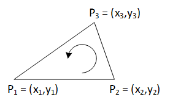

[](https://classroom.github.com/a/9YmZvTrY)
# **SWE4-Übungen - SS2024 - Übungszettel 3**

## **Konvexe Hülle (`src/convexhull`)**

Ein wesentliches Teilproblem der algorithmischen Geometrie ist die Bestimmung
der konvexen Hülle einer Menge von Punkten. Die konvexe Hülle einer Punktmenge
ist jene Untermenge von Punkten, die ein Polygon definieren, das alle Punkte der
Punktmenge umschließt. 

<div align="center">
  
</div>

Für die Ermittlung der
konvexen Hülle von Punkten existiert eine Reihe von Algorithmen. Der einfachste
darunter – leider auch der ineffizienteste – ist der sogenannte
*Gift-Wrapping-Algorithmus*. Dieses Verfahren ist auf folgender Wikipedia-Seite
ausführlich beschrieben: <http://en.wikipedia.org/wiki/Gift_wrapping_algorithm>.

1. Implementieren Sie zunächst eine Klasse `PointList` zur Verwaltung einer Menge
   von Punkten, die zumindest folgende öffentlichen Methoden anbietet:
    
    ```java
    public class PointList {
      public PointList();
        // Erzeugt eine leere Punktliste mit Kapazität 0.
      public PointList(int capacity);
        // Erzeugt eine leere Punktliste mit Kapazität capacity. 
      public int capacity();
        // Gibt die Kapazität der Punktliste zurück
      public int size(); 
        // Gibt die Größe der Punktliste zurück.
      public void changeCapacity(int newCapacity);
        // Verändert die Kapazität der Punktliste. newCapacity kann 
        // größer als, kleiner als oder gleich wie die alte Kapazität sein.
      public void add(Point p);
        // Fügt einen Punkt zur Menge hinzu. Erhöht bei Bedarf die Kapazität.
      public Point get(int i);
        // Liefert den i-ten Punkt der Menge.
      public PointList unify(PointList other);
        // Vereinigt diese Punktliste mit der Punktliste other und gibt eine
        // neue Punktliste zurück.
      public String toString();
        // Erzeugt einen String der Form [(x1,y1), ..., (xn,yn)].
    }
    ```

    `PointList` wird intern als Feld von Punkten repräsentiert. Am Ende des
    Punktfelds können null-Werte gespeichert sein, sodass auf effiziente Art und
    Weise Punkte an die Punktliste angehängt werden können. Reicht die Kapazität
    einer Punktliste nicht aus, wird die Kapazität automatisch erhöht, wobei die
    bisher gespeicherten Punkte erhalten bleiben.
    
    Implementieren Sie auch eine Klasse `Point` zur Darstellung von
    zweidimensionalen Punkten mit den benötigten Methoden.  

2. Erweitern Sie `PointList` um Funktionalität zur Bestimmung der konvexen Hülle:

    ```java
    public class PointList {
      public PointList convexHull();
        // Ermittelt die konvexe Menge der Punktliste.
        // Die zurückgegebene Punktliste enthält die Punkte der konvexen Hülle.
        // Die Punkte sind im Gegenuhrzeigersinn sortiert.
    }
    ```

    Verwenden Sie dazu den eingangs erwähnten *Gift-Wrapping-Algorithmus*.

3. Erweitern Sie `PointList` um eine Methode zur Generierung einer
   ASCII-Repräsentation der Punktliste.

    ```java
    public class PointList {
      public String toAsciiGraphic(int width, int height);
    }
    ```

    `toAsciiGraphic` liefert eine Zeichenkette der folgenden Form:

    ```text
      o        o
    o  x x    x   o
     o   x x    x
      o   x      o
         o  o    
    ```

    `width` und `height` definieren die Größe der ASCII-Grafik. Skalieren Sie
    die Punkte so, dass alle Punkte in der Grafik enthalten sind.
    
    Erweitern Sie dazu `Point` um eine Datenkomponente `label`, die definiert,
    mit welchem Zeichen ein Punkt bei der Ausgabe repräsentiert wird.


    *Hinweis:* Verwenden Sie zur Implementierung von `toAsciiGraphic` ein
    zweidimensionales Zeichenfeld.  

Erstellen Sie ein Hauptprogramm, in dem Sie Ihre Implementierung ausführlich
testen. Sie müssen in dieser Übung noch keine Unit-Tests erstellen.
Überprüfen Sie einerseits, ob Ihre Implementierung Trivialfälle (Menge mit 0, 1,
2, 3 Punkten) richtig behandelt. Testen Sie das Verhalten Ihres Programms aber
auch an großen Punktlisten. Sie können die Korrektheit der Hüllenberechnung sehr
einfach feststellen, indem Sie überprüfen, ob sich alle Punkte der gegebenen
Punktmenge innerhalb des konvexen Ergebnispolygons befinden.

Überprüfen Sie mithilfe der Methode `toAsciiGraphic` auch visuell die Korrektheit des Hüllenberechnungs-Algorithmus.

Sie dürfen bei dieser Übung (noch) keine Klassen des JDK-Behälter-Frameworks
verwenden.

Verdeutlichen Sie die logische Struktur Ihrer Lösung, indem Sie Pakete
einsetzen. Überprüfen Sie, ob Ihr Programm mit *Ant* gebaut und ausgeführt
werden kann. 

Um den Umgang mit den Entwicklungs-Werkzeugen für Java zu üben, erstellen Sie
ein Script `build-and-run.[bat|ps1|sh]`. Dieses Script muss die Quelltextdateien
Ihres Programms mit *javac* übersetzen, die generierten Binärdateien mit Hilfe
von *jar* in ein ein Java-Archiv verpacken und dieses anschließend mit *java*
ausführen. In diesem Script darf *Ant* nicht verwendet werden.

*Hinweis:* Zur Realisierung der angeführten Methoden ist es an einigen Stellen
notwendig, die Orientierung von drei Punkten zu ermitteln. 

<div align="center">
  
</div>

Dies kann ganz einfach durch Berechnung folgender Determinante erfolgen:

$$D = \text{Det}\left(
  \begin{matrix} 
    1 & x_1 & y_1 \\ 
    1 & x_2 & y_2 \\ 
    1 & x_3 & y_3
  \end{matrix}\right) = 
  x_2 y_3 + x_1 y_2 + x_3 y_1 - x_2 y_1 - x_3 y_2 - x_1 y_3$$

Ist $D > 0$, sind die Punkte $(x1, y1), (x2, y2), (x3, y3)$ gegen den
Uhrzeigersinn angeordnet (so wie im angeführten Beispiel), ist D < 0, sind sie
im Uhrzeigersinn orientiert; ist D = 0, liegen die Punkte auf einer Geraden. Mit
diesem Verfahren lässt sich auch ermitteln, ob sich ein Punkt links oder rechts
einer durch zwei Punkte bestimmten Linie befindet.
