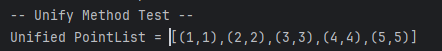
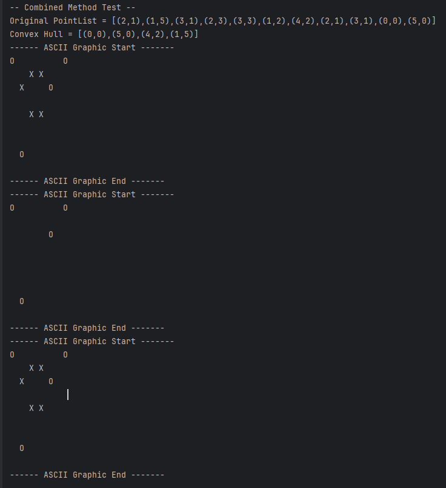

# **SWE4-Übungen - SS2024 - Übungszettel 3 - Ausarbeitung**

## **Konvexe Hülle**

### **Lösungsidee**

Die Kernidee des Programms basiert auf zwei wesentlichen Klassen: `Point` und `PointList`. Die `Point`-Klasse modelliert einen Punkt im zweidimensionalen Raum mit `x`- und `y`-Koordinaten sowie einem optionalen Label. `PointList` verwaltet eine Sammlung von `Point`-Objekten und bietet Methoden zum Hinzufügen, Abrufen und Vereinigen von Punkten sowie zur Berechnung der konvexen Hülle.

### Klassen und deren Relationen

- `Point`:
    - Eigenschaften: `x`, `y` (Koordinaten), `label` (Kennzeichnung des Punktes)
    - Methoden: Konstruktoren, Getter und Setter, `toString` (zur Darstellung des Punktes)

- `PointList`:
    - Eigenschaften: `points` (Array von `Point`-Objekten), `size` (Anzahl der gespeicherten Punkte)
    - Methoden:
        - Konstruktoren
        - `capacity`: Gibt die Größe des internen Arrays zurück.
        - `size`: Gibt die Anzahl der gespeicherten Punkte zurück.
        - `changeCapacity`: Passt die Größe des Arrays an eine neue Kapazität an.
        - `add`: Fügt der Liste einen neuen Punkt hinzu.
        - `get`: Ruft den Punkt an einem bestimmten Index ab.
        - `unify`: Vereint zwei `PointList`-Instanzen.
        - `toString`: Erzeugt eine String-Repräsentation der Punktliste.
        - `convexHull`: Berechnet die konvexe Hülle der Punktliste.
        - `orientation`: Hilfsmethode zur Bestimmung der Orientierung von drei Punkten.
        - `toAsciiGraphic`: Erstellt eine ASCII-Grafik, die die Punkte auf einem Raster darstellt.

### Implementierte Algorithmen

Die Methode `convexHull` implementiert den Jarvis-March-Algorithmus zur Berechnung der konvexen Hülle einer Punktmenge. Sie identifiziert den am weitesten links liegenden Punkt und fährt dann fort, weitere Punkte zu finden, die gegen den Uhrzeigersinn von diesem Punkt aus orientiert sind.

Die `toAsciiGraphic`-Methode stellt die Punkte auf einem charakterbasierten Raster dar, wobei die Größe des Rasters angepasst wird, um alle Punkte einzufassen.

## Struktur der Implementierung

Die `Main`-Klasse beinhaltet eine `main`-Methode, die als Einstiegspunkt dient und verschiedene Testfälle für die Klassen `Point` und `PointList` durchführt. Es gibt Hilfsmethoden wie `addPointsTo`, `printPointListDetails` und `printAsciiGraphic`, die für die Erstellung von Testfällen und die Ausgabe von Ergebnissen verwendet werden. Weitere Testmethoden `testUnify`, `testConvexHull`, `testCombined` und `testTrivialCases` demonstrieren spezifische Anwendungsfälle und Funktionalitäten des Programms.

### **Testfälle**

Testen der Klasse Point

 

Testen der Klasse PointList

Testen der unify Methode

Testen der convexHull Methode

Testen der Kombination von unify und convexHull

Testen von trivialen Fällen

